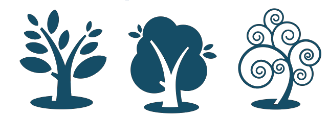

!SLIDE center
# Just Enough

!SLIDE center transition=fade
# Inspiration and Icons
## Scott Chacon, Github
[@chacon](http://twitter.com/chacon)

!SLIDE center transition=fade

# Git takes Snapshots
## of trees

!SLIDE center transition=fade
# What is a tree?

!SLIDE commandline incremental transition=fade

    $ tree things_i_bought
    things_i_bought
    ├── Gemfile
    ├── Gemfile.lock
    ├── README.md
    ├── Rakefile
    ├── app
    │   ├── assets
    │   │   ├── images
    │   │   │   └── rails.png
    │   │   ├── javascripts
    │   │   │   ├── application.js
    │   │   │   └── purchases.js.coffee
    │   │   └── stylesheets
    │   │       ├── application.css
    │   │       ├── purchases.css.scss
    │   │       └── scaffolds.css.scss
    │   ├── controllers
    │   │   ├── application_controller.rb
    │   │   └── purchases_controller.rb
    │   ├── helpers
    │   │   ├── application_helper.rb
    │   │   └── purchases_helper.rb
    │   ├── mailers
    │   ├── models
    │   │   └── purchase.rb

!SLIDE commandline center incremental

## Mac OS X peeps should install tree
### already installed on linux (and even windows!)
 
    $ brew update && brew install tree

!SLIDE center transition=fade
# Three Trees
## HEAD, Index, and Working Directory

!SLIDE center transition=fade

# What is HEAD?

!SLIDE center transition=fade
# HEAD == the latest commit

!SLIDE center transition=fade

!SLIDE center incremental transition=fade
# What is the index? 
* It's also called the staging area
* It's the files you're about to commit
  * but haven't yet
* it's the files you have git added
  * but not committed

!SLIDE incremental transition=fade
# What is 
# the working directory?
* pwd == print working directory
* it's simply the directory for your project
* it can have untracked files
* it's your sandbox to play in

!SLIDE center subsec bold

# git status #

!SLIDE code small

<pre>
<b>$ git status</b>
# On branch master
# Your branch is behind 'origin/master' by 2 commits,
#  and can be fast-forwarded.
#
# Changes to be committed:
#   (use "git reset HEAD <file>..." to unstage)
#
#       modified:   jobs/email_reply.rb
#
# Changed but not updated:
#   (use "git add <file>..." to update what will be committed)
#   (use "git checkout -- <file>..." to discard changes 
#     in working directory)
#
#       modified:   app/helpers/users_helper.rb
#       modified:   test/unit/email_reply_job_test.rb
#
</pre>

!SLIDE code small

<pre>
<b>$ git status</b>
# On branch master
# Your branch is behind 'origin/master' by 2 commits,
#  and can be fast-forwarded.
#
# Changes to be committed:
#   <strong>HEAD and index differ</strong>
#
#       modified:   jobs/email_reply.rb
#
# Changed but not updated:
#   <strong>index and working directory differ</strong>
#
#
#
#       modified:   app/helpers/users_helper.rb
#       modified:   test/unit/email_reply_job_test.rb
#
</pre>

!SLIDE center

!SLIDE center

!SLIDE center

!SLIDE center

!SLIDE center

!SLIDE

<pre>
<b>$ git status</b>
# On branch master
# Your branch is behind 'origin/master' by 2 commits,
#  and can be fast-forwarded.
#
# Changed but not updated:
#   (use "git add <file>..." to update what will be committed)
#   (use "git checkout -- <file>..." to discard changes 
#     in working directory)
#
#       modified:   file.txt
#
</pre>

!SLIDE center

!SLIDE center

!SLIDE

<pre>
<b>$ git status</b>
# On branch master
# Your branch is behind 'origin/master' by 2 commits,
#  and can be fast-forwarded.
#
# Changes to be committed:
#   (use "git reset HEAD <file>..." to unstage)
#
#       modified:   file.txt
#
</pre>

!SLIDE center

!SLIDE center

!SLIDE commandline incremental
# What is a remote?

    $ git remote -v
    origin  git@github.com:ivanoats/git_slides.git (fetch)
    origin  git@github.com:ivanoats/git_slides.git (push)

## another git repository

!SLIDE incremental bullets
# What is origin?
* the convention used for the name of the remote git repo on github, bitbucket
* could have called it my_source
* could have called it pancake

!SLIDE
# Branches
* are different commits (trees + files)

!SLIDE
# Branches
## What is master?
* simply a convention for the main branch
* could have called it first
* could have called it cookie_monster

!SLIDE incremental
# Common misconceptions
* don't call a branch "origin"
* don't call a remote "master"
* don't call a branch "index"
* don't call a branch a stick, a chanukah bush, or anything else derogatory

!SLIDE

* git pull remote_name branch_name

!SLIDE center transition=fade

# Demo (probably tomorrow)

!SLIDE

# Questions?

